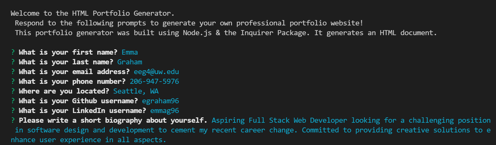
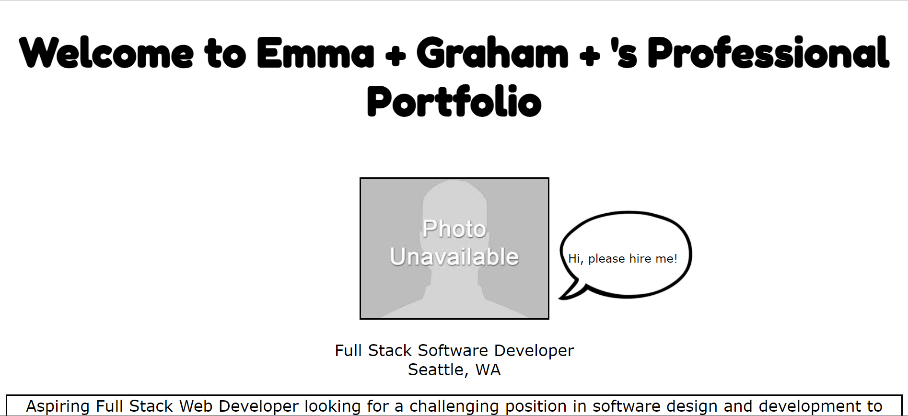

# HTML Portfolio Generator

## Description:
This week's homework required us to create a command-line application that dynamically generates a professional README.md file from a user's input using the NPM Inquirer package. The application will be invoked by using the node index.js in the user's command line. 

## Built With:
* HTML
* CSS
* Javascript
* [Library of Congress API](https://libraryofcongress.github.io/data-exploration/index.html)

## Deployed Links:
* [See Live Site](https://egraham96.github.io/Library-of-Congress-Search/)
* [Link to GitHub Repo](https://github.com/egraham96/Library-of-Congress-Search)
                                                                                        
## Preview of Working Site:

## How to Contribute:
If you'd like to contribute to this project please send an email to eeg4@uw.edu or message me on github: egraham96

## License:

